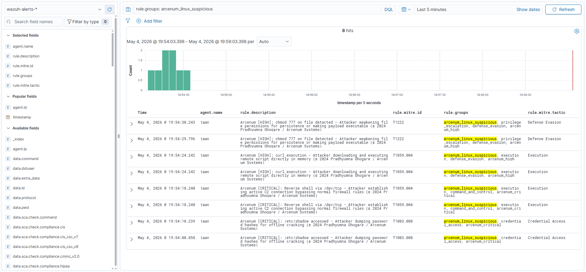
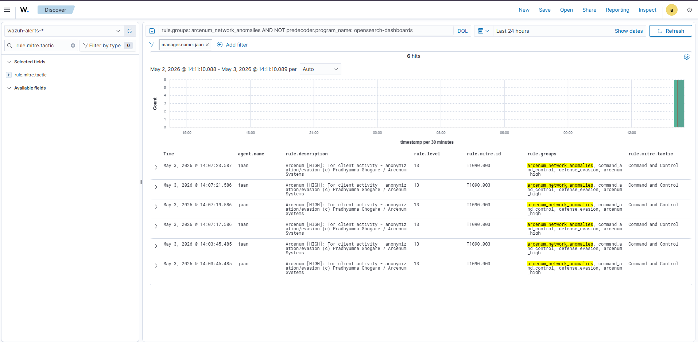
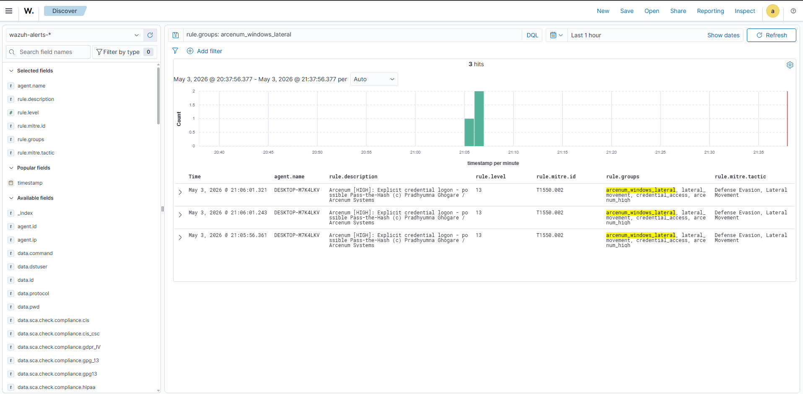

<div align="center">


# Arcenum Systems — Threat Detection Engine

### Advanced Wazuh Detection Rules for Modern Adversaries

*Kernel rootkits · Active Directory abuse chains · Cloud identity exploitation · Container escapes · Covert C2 channels*

**[arcenum-systems.vercel.app](https://arcenum-systems.vercel.app)** · **[Pradhyumna Ghogare](https://github.com/PradhyumnaGhogare)**

</div>

---

> **⚠️ PROPRIETARY DETECTION LOGIC**
> All detection patterns, rule logic, correlation techniques, and MITRE mappings are original research by **Pradhyumna Ghogare / Arcenum Systems**. Do not redistribute without attribution.

---

## What This Is

Most public Wazuh rule sets stop at surface-level detections — failed logins, obvious reverse shells, known bad binaries. **Adversaries who matter don't trigger those.**

The Arcenum Systems Threat Detection Engine is built around one question: *what does a sophisticated attacker actually do after they've already evaded your first layer?*

These rules detect:
- Kernel-level implants and eBPF abuse that bypass userspace monitoring
- Active Directory attack chains that look like legitimate traffic
- Cloud identity exploitation that leaves no footprint in standard logs
- Container escapes that start from inside a "secure" workload
- Covert C2 channels engineered to blend into normal network noise

All rules are mapped to MITRE ATT&CK sub-techniques, severity-classified for SOC workflows, and tested against real-world adversary TTPs — not synthetic lab traffic.

---

## Repository Structure

```
arcenum-systems-detection-rules/wazuh/
│
├── decoders/
│   ├── custom_decoder.xml                  # Arcenum Sentinel + Wolfsense EDR decoders
│   └── arcenum_advanced_decoders.xml       # K8s audit, Docker, eBPF, AWS enriched decoders
│
├── rules/
│   ├── core/                               # Foundational SOC Detections (v1.x)
│   │   ├── linux_suspicious_activity.xml   # Privilege escalation, reverse shells, LOLBins, persistence
│   │   ├── windows_lateral_movement.xml    # Credential dumping, PsExec, WMI, PowerShell abuse
│   │   ├── aws_cloudtrail_detections.xml   # IAM abuse, CloudTrail tampering, S3 exfil
│   │   └── network_anomalies.xml           # Port scans, DNS tunneling, C2 beaconing, Tor
│   │
│   └── advanced/                           # Threat Detection Engine (v2.0 — Proprietary)
│       ├── linux_kernel_advanced.xml       # eBPF, ptrace, fileless exec, namespace escape, rootkits
│       ├── windows_advanced_evasion.xml    # ETW/AMSI bypass, COM hijack, process hollow, ransomware
│       ├── active_directory_attacks.xml    # DCSync, Golden/Silver Ticket, Kerberoast, AD CS ESC
│       ├── aws_advanced_threats.xml        # Golden SAML, Lambda backdoor, IMDS SSRF, GuardDuty bypass
│       ├── network_advanced_covert.xml     # ICMP tunnel, DGA, domain fronting, LLMNR poisoning
│       └── container_kubernetes.xml        # Docker escape, K8s RBAC escalation, etcd access
│
└── README.md
```

---

## Detection Coverage

### 🐧 Linux Kernel & Advanced Evasion — `200001–200099`

Detects kernel-level attacks that operate below standard endpoint visibility. Rules trigger on syscall patterns, procfs manipulation, and memory subsystem abuse rather than process names or file paths — making them bypass-resistant.

| Rule ID | MITRE | Technique |
|---------|-------|-----------|
| 200001 | T1547.006 | Kernel module loaded (rootkit install) |
| 200003 | T1014 | Kernel hooking / module hiding |
| 200010 | T1056.004 | eBPF program loaded |
| 200011 | T1056.004 | eBPF kernel probe attached (syscall intercept) |
| 200020 | T1055.008 | ptrace memory write (code injection) |
| 200021 | T1055 | process_vm_writev cross-process injection |
| 200030 | T1574.006 | /etc/ld.so.preload hijack |
| 200040 | T1055 | /proc/PID/mem direct access |
| 200050 | T1620 | memfd_create fileless execution |
| 200060 | T1611 | Linux namespace escape |
| 200070 | T1562.001 | Auditd stopped / rules flushed |
| 200080 | T1014 | Syscall table access (kernel hook) |

**Core rules also cover** (`100001–100099`): privilege escalation via sudo/pkexec (CVE-2021-4034), cron/startup persistence, credential file access, reverse shell patterns, LOLBin abuse, and base64 decode chains.

---

### 🪟 Windows Advanced Evasion — `201001–201120`

Targets post-exploitation tradecraft used by APTs and ransomware operators — techniques specifically designed to evade EDR and Windows Defender. Detection logic anchors on behavioral sequences, not signatures.

| Rule ID | MITRE | Technique |
|---------|-------|-----------|
| 201001 | T1562.006 | ETW patching in PowerShell |
| 201002 | T1070.001 | Event log channel disabled |
| 201010 | T1562.001 | AMSI bypass in script block |
| 201020 | T1546.015 | COM object hijacking (HKCU) |
| 201030 | T1055.012 | Process hollowing sequence |
| 201040 | T1574.001 | System32 DLL replacement |
| 201050 | T1003.001 | LSASS PPL bypass tool |
| 201060 | T1562.001 | Windows Defender disabled |
| 201070 | T1548.002 | UAC bypass binary execution |
| 201080 | T1070.006 | Timestomping (SetFileTime) |
| 201090 | T1564.004 | NTFS alternate data stream |
| 201100 | T1490 | Shadow copy deletion (ransomware prep) |
| 201110 | T1546.003 | WMI permanent subscription |

**Core rules also cover** (`101001–101099`): LSASS/SAM/NTDS credential dumping, PsExec service installation, WMI lateral movement, BloodHound AD recon, offensive PowerShell frameworks, and scheduled task abuse.

---

### 🏛️ Active Directory Attacks — `202001–202110`

The most comprehensive open Wazuh ruleset for AD attack chains. Covers the full Kerberos abuse spectrum, directory service replication attacks, and certificate infrastructure exploitation — including AD CS ESC techniques that most SIEM vendors miss entirely.

| Rule ID | MITRE | Technique |
|---------|-------|-----------|
| 202001 | T1003.006 | DCSync replication rights abuse |
| 202010 | T1558.001 | Golden Ticket (RC4 TGS forgery) |
| 202020 | T1558.003 | Kerberoasting (bulk RC4 TGS requests) |
| 202030 | T1558.004 | AS-REP Roasting |
| 202040 | T1550.003 | Pass-the-Ticket (loopback TGT) |
| 202050 | T1207 | DCShadow (rogue DC registration) |
| 202060 | T1556.001 | Skeleton Key (LSASS patched) |
| 202070 | T1069.002 | BloodHound LDAP recon |
| 202080 | T1484.001 | GPO modification abuse |
| 202090 | T1649 | AD CS certificate abuse (ESC1–ESC8) |
| 202100 | T1134.005 | SID History injection |
| 202110 | T1222.001 | AdminSDHolder ACL modification |

---

### ☁️ AWS Advanced Threats — `203001–203090`

Cloud-native attack detection that goes beyond CloudTrail keyword matching. Rules reason about IAM call sequences, cross-account patterns, and service-specific abuse vectors used by threat actors like Scattered Spider and Cozy Bear.

| Rule ID | MITRE | Technique |
|---------|-------|-----------|
| 203001 | T1606.002 | Golden SAML (AssumeRoleWithSAML abuse) |
| 203010 | T1525 | Lambda backdoor injection |
| 203020 | T1552.005 | IMDSv1 SSRF credential theft |
| 203030 | T1555 | Secrets Manager bulk exfiltration |
| 203040 | T1562.008 | GuardDuty disabled |
| 203050 | T1021.007 | SSM lateral movement |
| 203060 | T1485 | KMS key destruction |
| 203070 | T1078.004 | Cross-account role chaining |
| 203080 | T1578 | CloudFormation backdoor stack |
| 203090 | T1530 | S3 bulk object exfiltration |

**Core rules also cover** (`102001–102099`): root account activity, IAM privilege escalation, new access key creation, CloudTrail disabling, S3 policy modification, console login without MFA, and brute-force indicators.

---

### 🌐 Network Covert Channels — `204001–204090`

Detects C2 traffic engineered to hide inside legitimate network protocols. Logic focuses on behavioral anomalies — payload size distributions, timing patterns, protocol field abuse — rather than IP blocklists.

| Rule ID | MITRE | Technique |
|---------|-------|-----------|
| 204001 | T1095 | ICMP tunneling |
| 204010 | T1090.004 | Domain fronting via CDN |
| 204020 | T1568.002 | DGA domain beacon |
| 204021 | T1568.002 | DGA NXDOMAIN cycling |
| 204030 | T1568.001 | Fast flux DNS (low TTL rotation) |
| 204040 | T1557.001 | LLMNR/NBT-NS poisoning |
| 204050 | T1557.002 | ARP spoofing / MitM |
| 204070 | T1210 | SMB EternalBlue sweep |
| 204090 | T1102 | C2 via legitimate web services |

**Core rules also cover** (`103001–103099`): firewall sweep detection, DNS tunneling indicators, C2 beaconing patterns, known backdoor port connections, abnormal outbound data transfer, and Tor client activity.

---

### 🐳 Container & Kubernetes — `205001–205080`

Purpose-built for cloud-native environments. Rules trigger on container runtime events, Kubernetes audit logs, and RBAC changes that indicate escape attempts or cluster compromise — decoded via the included K8s/Docker decoders.

| Rule ID | MITRE | Technique |
|---------|-------|-----------|
| 205001 | T1611 | Docker socket abuse from container |
| 205002 | T1611 | Host namespace sharing (hostPID/hostNetwork) |
| 205010 | T1611 | Host filesystem mount from container |
| 205011 | T1611 | cgroup release_agent escape |
| 205020 | T1609 | kubectl exec shell into running pod |
| 205021 | T1078.001 | cluster-admin ClusterRoleBinding created |
| 205030 | T1528 | K8s service account token theft |
| 205040 | T1552.007 | Direct etcd port access (2379/2380) |
| 205060 | T1496 | Cryptominer process in container |
| 205071 | T1525 | Image pulled from raw IP registry |
| 205080 | T1078.001 | ClusterRole RBAC privilege escalation |

---

## Severity Classification

| Wazuh Level | Arcenum Tag | SLA | Trigger Meaning |
|-------------|-------------|-----|-----------------|
| 15 | `arcenum_critical` | Immediate — page SOC, isolate host | High-confidence attack in progress |
| 13–14 | `arcenum_high` | Investigate within 1 hour | Strong TTP signal, low FP rate |
| 11–12 | `arcenum_medium` | Review within business hours | Suspicious but requires context |

All alerts carry an inline `WHY THIS FIRES` comment in the XML explaining the adversary motivation — designed for L1/L2 analysts to triage without needing to look up the technique.

---

## Deployment

### Prerequisites

- Wazuh Manager **4.x or above**
- Root / sudo access on the Wazuh Manager node
- Wazuh Agent deployed on monitored endpoints

### Install

```bash
# 1. Clone the repository
git clone https://github.com/PradhyumnaGhogare/arcenum-systems-detection-rules.git
cd arcenum-systems-detection-rules/wazuh

# 2. Deploy rule files
sudo cp rules/core/*.xml /var/ossec/etc/rules/
sudo cp rules/advanced/*.xml /var/ossec/etc/rules/

# 3. Deploy decoders
sudo cp decoders/*.xml /var/ossec/etc/decoders/

# 4. Validate before restart
sudo /var/ossec/bin/wazuh-logtest

# 5. Apply
sudo systemctl restart wazuh-manager
```

### Verify Rules Are Loaded

```bash
# Check rule loading
sudo /var/ossec/bin/wazuh-logtest -V | grep -i arcenum

# Or in the Wazuh dashboard:
# Rules → Custom Rules → filter by group: arcenum_*
```

### Rule ID Reference

| Range | File | Domain |
|-------|------|--------|
| `100001–100099` | `linux_suspicious_activity.xml` | Linux Core |
| `101001–101099` | `windows_lateral_movement.xml` | Windows Core |
| `102001–102099` | `aws_cloudtrail_detections.xml` | AWS Core |
| `103001–103099` | `network_anomalies.xml` | Network Core |
| `200001–200099` | `linux_kernel_advanced.xml` | Linux Advanced |
| `201001–201120` | `windows_advanced_evasion.xml` | Windows Advanced |
| `202001–202110` | `active_directory_attacks.xml` | Active Directory |
| `203001–203090` | `aws_advanced_threats.xml` | AWS Advanced |
| `204001–204090` | `network_advanced_covert.xml` | Network Covert |
| `205001–205080` | `container_kubernetes.xml` | Containers / K8s |

---

## Tuning for Your Environment

Do **not** edit rule files directly — it makes upgrades painful. Instead, override in a local rules file:

```xml
<!-- /var/ossec/etc/rules/local_rules.xml -->
<group name="arcenum_overrides,">

  <!-- Suppress medium-severity sudo alerts for your jump host -->
  <rule id="100099" level="0">
    <if_sid>100001</if_sid>
    <srcip>10.0.1.50</srcip>
    <description>Tuning: suppressed sudo alert for jump host</description>
  </rule>

</group>
```

Use `<if_not_sid>` and `<srcip>` / `<user>` filters to reduce false positives without touching the original ruleset.

---

## About

Built by **[Pradhyumna Ghogare](https://github.com/PradhyumnaGhogare)** as part of the **Arcenum Systems** independent cybersecurity R&D initiative.

Arcenum Systems is a SIEM+UEBA platform with Wazuh at its core, extended with a custom Node.js backend, React frontend, and behavioral analytics layer — built to give lean security teams enterprise-grade threat detection without enterprise-grade budgets.


- 🔬 **Wolfsense EDR:** [github.com/PradhyumnaGhogare/wolfsense-edr](https://github.com/PradhyumnaGhogare/wolfsense-edr)
- 👤 **GitHub:** [github.com/PradhyumnaGhogare](https://github.com/PradhyumnaGhogare)

---

## Live Production Alerts

Tested and verified on **Wazuh 4.14.5** — rules firing in production environment.

### Linux Suspicious Activity — Live Dashboard


### Network Anomalies — Live Dashboard


### Windows Lateral Movement — Dashboard


> Production verified — Wazuh 4.14.5 | Pradhyumna Ghogare / Arcenum Systems

## License & Attribution

© 2026 Pradhyumna Ghogare / Arcenum Systems. MIT License — free to use and modify with attribution.

All detection patterns, rule logic, and MITRE mappings are original research. If you use these rules in your environment or build on them, attribution is appreciated.

---

<div align="center">

*Engineered for adversaries who think no one is watching.*

**— Pradhyumna Ghogare, Arcenum Systems © 2026**

</div>
